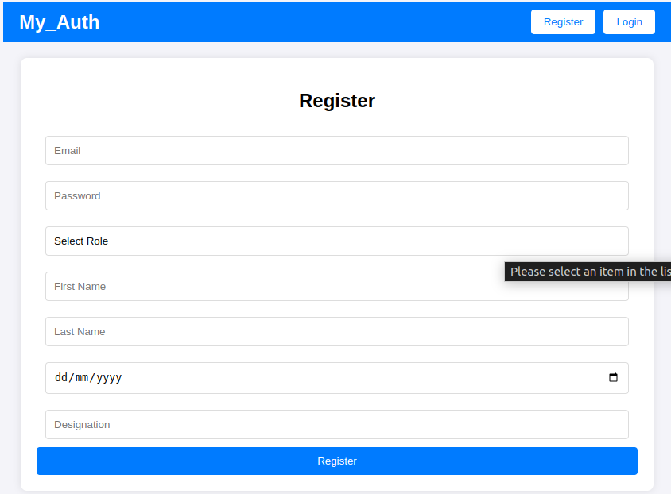
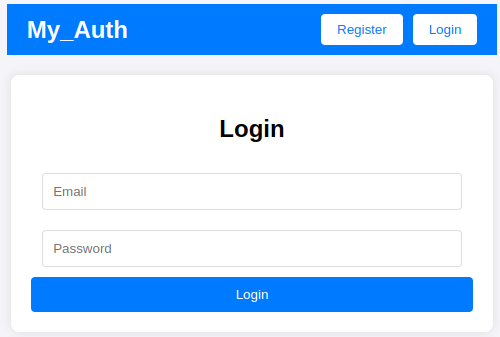
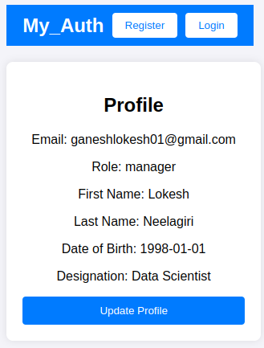
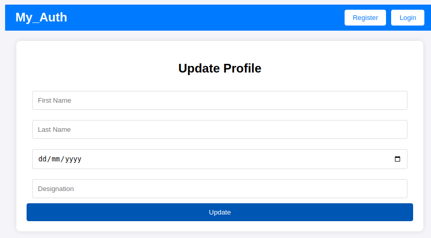

# MyAuth Application

Welcome to the MyAuth Application! This project is a full-stack application built with FastAPI for the backend and React for the frontend. It provides user authentication, profile management, and user listing functionalities.

## Features

- **User Registration**: Create a new account with role-based access.
- **User Login**: Authenticate and receive a JWT token.
- **Profile Management**: View and update your profile details.
- **User Listing**: Admins and managers can view a list of users.

## Technologies Used

- **Backend**: FastAPI, SQLAlchemy, SQLite
- **Frontend**: React, Axios
- **Authentication**: JWT

## Setup Instructions

### Backend

1. **Install Dependencies**:
   ```bash
   pip install fastapi sqlalchemy pydantic passlib bcrypt python-jose
   ```

2. **Run the Server**:
   ```bash
   uvicorn main:app --reload
   ```

### Frontend

1. **Navigate to the Frontend Directory**:
   ```bash
   cd frontend
   ```

2. **Install Dependencies**:
   ```bash
   npm install
   ```

3. **Start the React App**:
   ```bash
   npm start
   ```









## API Endpoints

- **POST** `/register`: Register a new user.
- **POST** `/login`: Authenticate a user.
- **GET** `/profile`: Get the current user's profile.
- **PUT** `/profile`: Update the current user's profile.
- **GET** `/users`: List all users (admin/manager only).

## Contributing

Contributions are welcome! Please fork the repository and submit a pull request.

## License

This project is licensed under the MIT License.

## Contact

For any inquiries, please contact [your-email@example.com](mailto:your-email@example.com). 